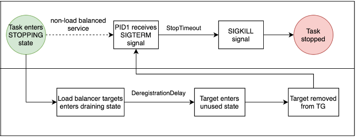

# Spring boot application graceful shutdown in docker containers
Graceful shutdown means that before shutting down the application, there should be timeout period 
given to allow the requests to complete which are still in progress. No new requests would be 
allowed during this timeout period.

# Spring Boot Graceful Shutdown
Spring boot application doesn't shut down graceful by default when it receives SIGTERM signal.
### Web Server - Tomcat
The common behaviour for the web server is to shut down immediately after receiving a SIGTERM, 
not waiting for any persistent keep-alive connections to be properly finished and closed. <br />

To enable the graceful shutdown, set the `server.shutdown` property to `graceful` in 
the `application.yml` file. The default value of this property is `immediate`. <br />

After this change, the server will wait 30 seconds for those active requests to finish their work.
This grace period can be increased to 1 minute using the property 
`spring.lifecycle.timeout-per-shutdown-phase=1m`. <br />

When the web server receives SIGTERM signal, it waits for all pending requests to complete, but 
it will not accept any new requests.  Tomcat will stop accepting requests at the network layer. 
Refer [this](https://docs.spring.io/spring-boot/docs/2.3.0.RELEASE/reference/html/spring-boot-features.html#boot-features-graceful-shutdown) 
link for more details.
### Scheduler
Spring boot scheduler requires additional configuration to shut down gracefully. Use 
`spring.task.scheduling.shutdown.await-termination=true` and `spring.task.scheduling.shutdown.await-termination-period=1m`
to enable graceful shutdown.

# Container
When container orchestrator wants to stop a container, it sends SIGTERM signal to container’s 
entry process, usually PID 1. It sends SIGKILL signal after the timeout has lapsed.<br />

If `ENTRYPOINT` in Dockerfile defines `bash/sh` as the entry process like in below examples, then
`bash/sh` runs as main process (with PID 1) and the spring boot application runs as child process
spawned by PID 1. `bash/sh` receives the SIGTERM signal when the container is stopped but never 
passes it on to spring boot application and is not configured to perform any action on this signal.
When the container receives the SIGKILL signal, `bash/sh` and all of its child processes are 
immediately terminated.
```
ENTRYPOINT ["bash", "-c", "java ${JAVA_OPTS} org.springframework.boot.loader.JarLauncher"]
ENTRYPOINT ["bash", "-c", "/var/tmp/docker-entrypoint.sh"]
```

`exec` is useful to run a command and no longer need the shell after the command exits. When `exec` 
command runs, it replaces the contents of the currently running process (the shell in this case) 
with a new executable. This is important as it relates to signal handling. For example, running 
`exec java org.springframework.boot.loader.JarLauncher`, the `java` command now runs as the same PID 
as the shell ran. Without exec, the server would run as a separate child process and would not 
automatically receive the SIGTERM signal delivered to the entry process. Refer 
[Dockerfile](./Dockerfile) and [entrypoint.sh](./entrypoint.sh) for more details.

### ECS
ECS service can be configured in 2 different way.
1. Configured to use an ALB<br />
   When the ECS task is stopped, ECS deregister the task from ALB's target group. Deregistering the 
   task ensures that all new requests are redirected to other tasks in the load balancer’s 
   target group while existing connections to the task are allowed to continue until the 
   `DeregistrationDelay` expires. After that, it sends the `SIGTERM` signal to the container in the 
   ECS task, then it waits until `StopTimeout` before sending `SIGKILL` signal.
2. Configured to run as standalone (example: scheduler, asynchronous process)
   It sends the `SIGTERM` signal to the container in the ECS task, then it waits until 
   `StopTimeout` before sending `SIGKILL` signal.

Refer [ecs-service.yml](./deployment/cfn/ecs-service.yml) for `StopTimeout` configuration.



### Build
###### Build application and create local image
```
mvn clean install
```
###### Build application and push image to remote repository
```
mvn clean deploy
```

### Run
###### Local
- Run `docker-compose up -d postgres-db` to start the Postgres container
- Run `docker-compose up -d activemq` to start the Active MQ container
- Refer [this](.run/Application.run.xml) Run Configuration and run it to start the spring boot application
- Run following endpoints in Postman:
  - [Get All Users](http://localhost:8080/users)
  - [Hello](http://localhost:8080/hello)
- Click `Exit` button in `Run` tab in Intellij IDE to send `SIGTERM` signal to spring boot application
- Look at the logs to make sure spring boot application receives the `SIGTERM` signal and shutdown the application gracefully

###### Docker Compose
- Run `docker-compose up -d` to start the all containers
- Check spring boot application logs using `docker-compose logs -f testapp`
- Run following endpoints in Postman:
    - [Get All Users](http://localhost:8080/users)
    - [Hello](http://localhost:8080/hello)
- Get into the spring boot application container using `docker exec -it spring-boot-graceful-shutdown_testapp_1 bash` command
  - Run `ls -l /proc/*/exe` and make sure that Java process started with PID 1
- Run `docker-compose stop` to send `SIGTERM` signal to spring boot application
- Look at the logs to make sure spring boot application receives the `SIGTERM` signal and shutdown the application gracefully
